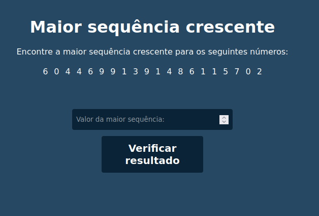
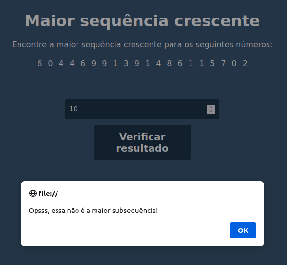
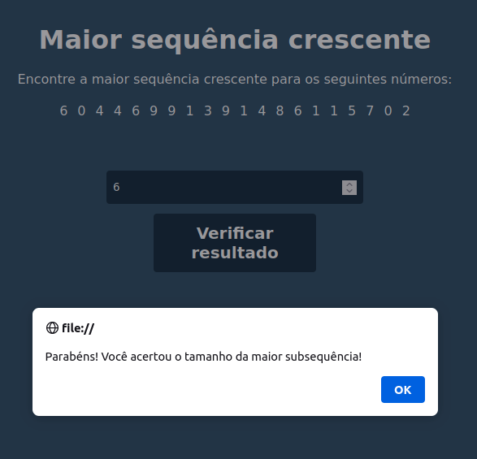

# Maior Subsequência

**Conteúdo da Disciplina**: PD<br>

## Alunos
|Matrícula | Aluno |
| -- | -- |
| 19/0027088 |  Eliás Yousef Santana Ali |
| 20/0038141  | Gustavo Duarte Moreira |

## Sobre 
O objetivo do projeto é implementar um algoritmo que encontre a maior subsequência crescente de um vetor. A maior subsequência é uma sequência que pode ser obtida a partir de outra sequência removendo zero ou mais elementos sem mudar a ordem dos elementos restantes.

O usuário deve olhar a sequência aleatória e tentar encontrar a maior subsequência crescente. E informar o seu tamanho da e o sistema verificará se o usuário acertou utilizando o algoritimo.

## Screenshots











## Instalação 
**Linguagem**: javascript<br>
**Framework**: N/A<br>

***Pre-requsitos***

Possuir um navegador de internet instalado na máquina.

## Uso 
**Clonar o repositório**
```
    git clone https://github.com/projeto-de-algoritmos/PD_Maior_Subsequencia
```
**Entar o repositório**
```
    cd PD_Maior_Subsequencia/src
```
**Executar o comando**
```
    Abrir o arquivo index.html em um navegador
```
## Outros 
Observação: Os testes foram realizados em dois computadores um no sitema operacional UBUNTU 20.04 e outro no Windows 10.


## Video

[Video da apresentação](video/PD_Maior_Subsequencia.mp4)


